# TaskPilot — Project Collaboration Platform

TaskPilot là ứng dụng quản lý công việc theo project, giúp nhóm tạo project, mời thành viên, giao task, trao đổi bằng comment và theo dõi tiến độ trên dashboard. Dự án được xây dựng với Spring Boot, có xác thực JWT, notification realtime, Redis cache và môi trường chạy bằng Docker Compose.

> **Live demo:** _Sẽ cập nhật link deployment._
>
> **API documentation:** `http://localhost:8080/swagger-ui/index.html` sau khi chạy ứng dụng.

## Chạy dự án

### Cách nhanh nhất — Docker Compose

Yêu cầu: Docker Desktop.

```bash
git clone <repository-url>
cd taskpilot
copy .env.example .env
docker compose up --build
```

Trên macOS/Linux, thay dòng `copy` bằng:

```bash
cp .env.example .env
```

Sau khi containers khởi động:

| Dịch vụ | Địa chỉ |
|---|---|
| TaskPilot | http://localhost:8080 |
| Swagger UI | http://localhost:8080/swagger-ui/index.html |
| Mailpit (xem email local) | http://localhost:8025 |
| MySQL | `localhost:3306` |
| Redis | `localhost:6379` |

Dừng môi trường:

```bash
docker compose down
```

### Chạy local bằng Maven

Yêu cầu: Java 17, MySQL 8+ và Maven Wrapper có trong repository.

1. Tạo database:

```sql
CREATE DATABASE TASKPILOT CHARACTER SET utf8mb4 COLLATE utf8mb4_unicode_ci;
```

2. Tạo file `src/main/resources/application.properties` từ cấu hình mẫu dưới đây. File này được Git ignore để không đưa mật khẩu lên repository.

```properties
spring.datasource.url=jdbc:mysql://localhost:3306/TASKPILOT?useSSL=false&serverTimezone=Asia/Ho_Chi_Minh&allowPublicKeyRetrieval=true
spring.datasource.username=root
spring.datasource.password=your_mysql_password
spring.jpa.hibernate.ddl-auto=update
spring.jpa.show-sql=true
server.port=8080

app.jwt.secret=replace-with-a-random-secret-at-least-32-characters
app.jwt.expiration-ms=86400000
app.mail.enabled=false
spring.mail.host=localhost
spring.mail.port=1025
```

3. Chạy ứng dụng:

```powershell
.\mvnw.cmd spring-boot:run
```

4. Truy cập `http://localhost:8080/login` và đăng ký tài khoản mới.

## Luồng hệ thống

```mermaid
flowchart LR
    A[Người dùng đăng ký / đăng nhập] --> B[Dashboard]
    B --> C[Tạo Project]
    C --> D[Mời thành viên bằng email]
    D --> E[Notification DB + WebSocket + Email tùy chọn]
    E --> F[Thành viên tham gia Project]
    F --> G[Tạo và giao Task]
    G --> H[Assignee nhận notification]
    H --> I[Cập nhật status / thêm comment]
    I --> J[Task History + Activity Log]
    J --> K[Dashboard cập nhật thống kê]
```



### Luồng nghiệp vụ chi tiết

1. Người dùng đăng ký hoặc đăng nhập bằng form web. Với API client, `POST /api/auth/login` trả về JWT Bearer token.
2. Owner tạo project; hệ thống tự tạo `ProjectMember` với role `ADMIN` cho owner.
3. Owner mời một tài khoản đã đăng ký qua email. Thành viên được tạo ở trạng thái chờ (`active = false`) và nhận notification.
4. Khi thành viên tham gia project, họ có thể xem task và cộng tác trong project đó.
5. Thành viên tạo task, gán task cho một thành viên active, chọn trạng thái, ưu tiên và deadline.
6. Khi task được gán hoặc có comment, người liên quan nhận notification trong database; hệ thống cũng publish realtime qua WebSocket. Nếu bật email, notification được gửi qua SMTP.
7. Các thay đổi task được lưu vào `TaskHistory` và `ActivityLog`; dashboard tổng hợp project, task, tiến độ, notification và hoạt động gần đây.

## Chức năng hiện có

### Xác thực và bảo mật

- Đăng ký và đăng nhập bằng Spring Security.
- Form-login cho giao diện Thymeleaf.
- JWT Bearer token cho REST API.
- Mật khẩu được mã hóa BCrypt.
- API yêu cầu người dùng đã xác thực; task kiểm tra thành viên project trước khi truy cập.

### Project và thành viên

- Tạo, xem, cập nhật và xóa mềm project.
- Mời/re-mời thành viên theo email.
- Thành viên chấp nhận lời mời bằng API join project.
- Owner quản lý project; member active có thể truy cập dữ liệu project.

### Task và collaboration

- CRUD task: tiêu đề, mô tả, priority, status, deadline và assignee.
- Status: `TODO`, `IN_PROGRESS`, `REVIEW`, `DONE`.
- Priority: `LOW`, `MEDIUM`, `HIGH`, `URGENT`.
- Comment theo task.
- Task history và activity log.
- Phân quyền sửa/xóa task theo creator, assignee và project owner.

### Dashboard và notification

- Thống kê tổng project, tổng task, completed/pending task và team members.
- Recent projects, recent tasks, activity timeline, analytics cơ bản.
- Notification chưa đọc được cache bằng Redis.
- Notification realtime qua STOMP WebSocket.
- Email notification có thể bật/tắt bằng biến môi trường.

## Kiến trúc kỹ thuật

```text
Browser / API Client
        │
        ├── Thymeleaf pages (Dashboard, Projects, Tasks)
        ├── REST API (/api/**) + JWT
        └── STOMP WebSocket (/ws)
                  │
            Spring Boot
        ├── Controllers
        ├── Services / authorization rules
        ├── JPA repositories
        ├── NotificationPublisher
        └── Redis cache
             │       │
          MySQL   SMTP / Mailpit
```

## Công nghệ sử dụng

| Nhóm | Công nghệ |
|---|---|
| Backend | Java 17, Spring Boot 3, Spring MVC |
| Database | MySQL 8, Spring Data JPA, Hibernate |
| Security | Spring Security, BCrypt, JJWT |
| Frontend | Thymeleaf, HTML/CSS/JavaScript |
| Realtime | Spring WebSocket, STOMP |
| Cache | Redis, Spring Cache |
| Email | Spring Mail, Mailpit local |
| API docs | OpenAPI / Swagger UI |
| Infrastructure | Docker, Docker Compose |
| Quality | JUnit 5, Mockito, GitHub Actions |

## API quan trọng

### Authentication

| Method | Endpoint | Mô tả |
|---|---|---|
| `POST` | `/api/auth/register` | Đăng ký tài khoản |
| `POST` | `/api/auth/login` | Đăng nhập API, nhận JWT |

Ví dụ login API:

```json
POST /api/auth/login
{
  "email": "member@example.com",
  "password": "your-password"
}
```

Response:

```json
{
  "token": "eyJ...",
  "tokenType": "Bearer",
  "expiresIn": 86400
}
```

Sau đó gửi header:

```text
Authorization: Bearer <token>
```

### Projects, tasks và notifications

| Method | Endpoint | Mô tả |
|---|---|---|
| `GET/POST` | `/api/projects` | Danh sách / tạo project |
| `PUT/DELETE` | `/api/projects/{id}` | Sửa / xóa project |
| `POST` | `/api/projects/{id}/invite` | Mời thành viên |
| `POST` | `/api/projects/{id}/join` | Chấp nhận lời mời |
| `GET/POST` | `/api/tasks` | Danh sách / tạo task |
| `PUT/DELETE` | `/api/tasks/{id}` | Sửa / xóa task |
| `GET/POST` | `/api/tasks/{id}/comments` | Xem / thêm comment |
| `GET` | `/api/tasks/{id}/history` | Lịch sử task |
| `GET` | `/api/notifications` | Notification gần đây |
| `GET` | `/api/notifications/unread-count` | Số notification chưa đọc |

Chi tiết schema request/response luôn có tại Swagger UI.

## Cấu hình Email và Realtime

### Email

Mặc định `MAIL_ENABLED=false`, do đó phát triển local không cần SMTP. Để gửi email thật, cấu hình biến môi trường:

```env
MAIL_ENABLED=true
MAIL_HOST=smtp.example.com
MAIL_PORT=587
MAIL_USERNAME=your-account
MAIL_PASSWORD=your-app-password
MAIL_SMTP_AUTH=true
MAIL_STARTTLS=true
```

Trong Docker local, Mailpit nhận email tại `http://localhost:8025`.

### WebSocket

- STOMP endpoint: `/ws`
- User notification destination: `/user/queue/notifications`

Frontend client có thể subscribe destination trên để hiển thị notification mà không cần refresh trang.

## Kiểm thử và CI/CD

Chạy test:

```powershell
.\mvnw.cmd test
```

GitHub Actions ở `.github/workflows/ci.yml` chạy `./mvnw verify` mỗi khi push hoặc tạo Pull Request vào `main`/`master`.

CI đang kiểm tra build và test. CD deploy production sẽ được bổ sung khi có lựa chọn nền tảng triển khai và GitHub Secrets tương ứng, ví dụ `JWT_SECRET`, database credentials và SMTP credentials.

## Cấu trúc thư mục

```text
src/main/java/com/example/
├── config/        # Security, JWT filter, WebSocket, Swagger, cache
├── controller/    # Web pages và REST APIs
├── dto/           # API request/response models
├── entity/        # JPA entities
├── repository/    # Data access
├── service/       # Business logic, notification publisher
└── enums/         # Task status, priority, project roles

src/main/resources/
├── templates/     # Thymeleaf pages
├── static/        # CSS và JavaScript
└── application.properties
```

## Hướng phát triển tiếp

- Trang nhận/chấp nhận invitation trực quan.
- Trang quản lý team và role.
- Notification dropdown realtime trên dashboard.
- Search, calendar, báo cáo analytics theo thời gian.
- CD deployment lên nền tảng được chọn.
